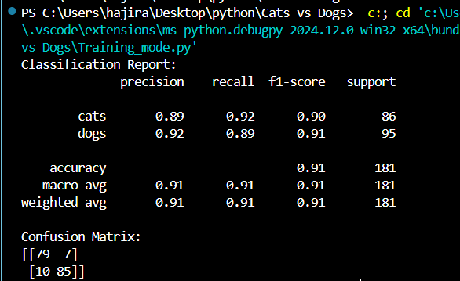
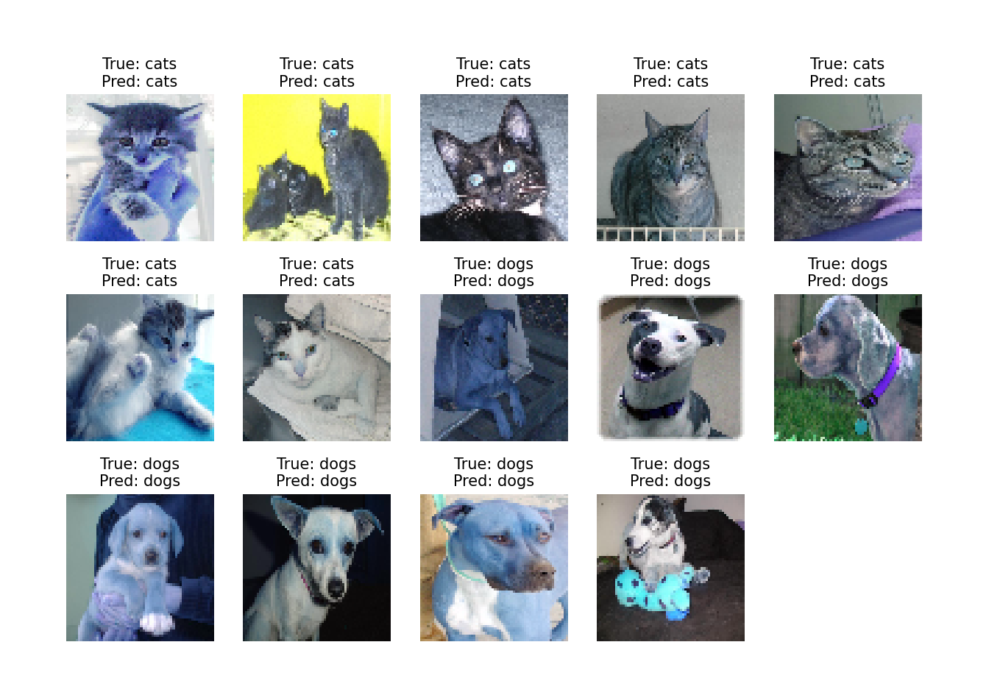
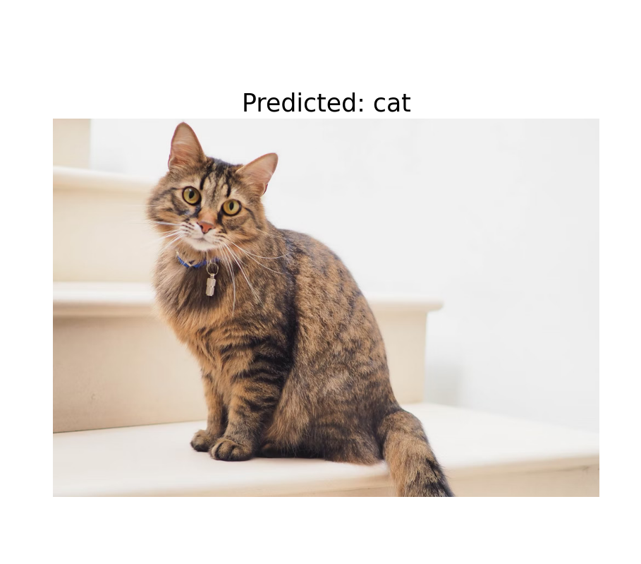

# Dog vs Cat Classification Project

## Introduction

This project is designed to classify images of dogs and cats using a deep learning model. The trained model can accurately predict whether a given image is of a dog or a cat. While the original dataset is not included in this repository, the trained model and the application are provided for demonstration purposes.

## Project Structure

- `cat_dog_classifier_pipeline.pkl`: Contains the trained model file.
- `Classifier.py`: Main application code for making predictions.
# Results

Here are some sample results from the model:

### Model Performance Report



*A report plot showing model performance.*

---

### Prediction Results



*A plot showing predictions made by the model.*

---

### Sample Prediction


*A sample image used for prediction.*


## Requirements

To run this project, ensure you have the following packages installed:

```bash
pip install numpy pandas matplotlib tensorflow

 
